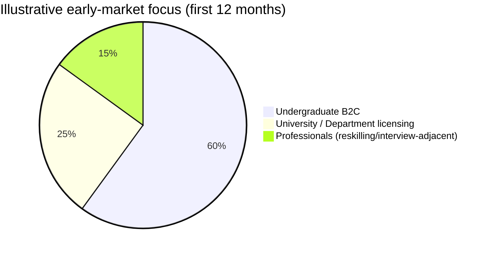
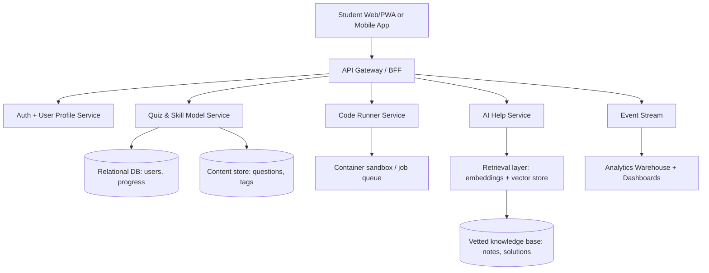

# Deep Research Report on Building a Mobile/Web Practice App for Data Science, AI, and CS Undergraduates

## Executive summary

Undergraduate learners in Data Science/AI/CS already use a fragmented stack: (a) **coding-challenge platforms** for algorithm practice and interviewing, (b) **course platforms** for structured curricula and credentials, and (c) **flashcard/quiz tools** for memorization and exam prep. The competitive landscape is wide—ranging from interview-driven platforms (e.g., LeetCode + Ask Leet AI features) to broad-learning ecosystems (e.g., Coursera with 197M registered learners) to quiz utilities (e.g., Quizlet’s subscription plans and offline studying support). citeturn7search2turn6search6turn12search2turn25view1

A new entrant can succeed if it **narrows scope** to a “course-aligned practice layer” for undergrads: fast retrieval practice, code-and-quiz mixed items, and **in-context help that teaches rather than answers** (guided hints, concept checks, error diagnosis, and targeted next problems). This is a distinct value proposition in a market where users often report either (1) paywalls and interview-centric content misaligned with coursework, or (2) shallow explanations and reliance on external resources and AI tools. citeturn7search9turn19search12turn19search8

A practical MVP strategy is to ship a **web-first product** (responsive PWA) plus a thin mobile shell later, focusing on: topic-based quizzes, code execution for a small set of languages, spaced review scheduling, progress analytics, and an AI help system backed by retrieval over vetted course notes and explanations. Evidence-based learning research strongly supports retrieval practice, spacing, worked examples, and timely/specific formative feedback—each can be directly operationalized in-app. citeturn27search32turn28view0turn28view2turn28view1

Cost sensitivity matters for students: many incumbents rely on subscriptions (e.g., Codewars $5/month; LeetCode Premium often framed at $35/month and $159/year value; Khan Academy’s Khanmigo is $4/month for families/learners) and/or enterprise pricing for institutions. citeturn17search6turn7search10turn18search2

## Competitive landscape

### Landscape overview

The market splits into five main clusters:

1) **Interview & coding-skill platforms**: large banks of problems, autograding, rankings, and increasingly AI support (notably LeetCode’s “Ask Leet” coding agent positioning). citeturn7search2turn6search6  
2) **MOOCs and structured credential platforms**: deep catalogs, projects, quizzes, certificates, and enterprise offerings (Coursera and edX dominate by reported learner scale). citeturn12search2turn0search9turn15search2  
3) **Data-focused training ecosystems**: practical micro-courses, notebooks, and data tooling communities (DataCamp; Kaggle Learn). citeturn8search28turn3search0  
4) **Practice quiz / flashcard apps**: user-generated or self-authored material with study modes and offline usage (Quizlet; Anki). citeturn25view1turn15search14turn4search26  
5) **University assessment infrastructure**: autograding and LMS integration for instructors (e.g., Mimir Classroom; Gradescope; PrairieLearn). citeturn22view0turn18search4turn18search5  

image_group{"layout":"carousel","aspect_ratio":"1:1","query":["Brilliant learning app screenshots","Quizlet flashcards mobile app screenshot","Codecademy Go app screenshot","DataCamp mobile app screenshot"],"num_per_query":1}

### Competitive inventory with product links, features, pricing, segments, and scale

**Notes on interpretation:** Prices vary by region, promotion, and plan type; where numeric pricing could not be reliably extracted from official pages, it is listed as **Unspecified** per your instruction. Some sites block automated access to price pages; those are marked accordingly. citeturn16search5turn25view1turn22view0

| Platform | Official product/pricing references | Core features (high level) | Pricing model (examples) | Target segments | Platforms | User base size (if available) |
|---|---|---|---|---|---|---|
| LeetCode | Product: citeturn6search5 Pricing/features: citeturn7search2turn7search10turn7search9turn7search5 | Coding challenges; company-tagged practice; mock/interview features; “Ask Leet” AI agent; faster judging (“Lightning Judge”) as Premium benefits | Free tier + Premium subscription; LeetCode posts frame Premium value at **$35/month** and **$159/year**; promotions (e.g., $139 annual with code) | Students, job-seekers, professionals | Web; official mobile app exists for 力扣 (CN) with mobile coding/judging and Plus subscription pricing in RMB citeturn6search0 | Unspecified (no stable official number found) |
| HackerRank | Product: citeturn15search5 Community size claim: citeturn5search10turn5search14 | Practice (Prepare), certifications, competitions; widely used for hiring/assessments | Practice is free; hiring/enterprise pricing is tiered/quote-based; HackerRank marketing indicates “publicly listed tiers starting at $165/month” (context: competitive pricing commentary) citeturn17search24 | Students (practice), employers (assessments), training programs | Web; desktop assessment app exists for “app only test” flows citeturn15search20 | “Join over 28 million developers” / “Home to 26M developers” (marketing copy varies by page) citeturn5search10turn5search14 |
| Coursera | Platform & scale: citeturn12search2 Coursera Plus: citeturn16search5 Mobile apps: citeturn16search0turn16search1 | Courses, projects, certificates, degrees; mobile offline downloads; enterprise plans include AI Coach and dashboards | Subscription bundles (Coursera Plus); course-by-course purchases; business plans (e.g., Teams shown at $399/user/year on compare page) citeturn16search13 | Students, professionals; enterprises | Web + iOS/Android apps | 197M registered learners (as of Dec 31, 2025) citeturn12search2 |
| edX | Scale: citeturn0search9 Mobile: citeturn15search2 | Courses, certificates, degrees; mobile video streaming and downloads; quizzes/assignments in app | Audit many courses for free; verified certificate upgrades starting ~$50 and often up to ~$300 depending on course/program citeturn1search1 | Students, professionals; institutions | Web + iOS/Android apps | 100M learners (milestone messaging) citeturn0search9 |
| DataCamp | Pricing + scale: citeturn8search28 Mobile: citeturn14search3turn14search11 | Interactive data/AI courses, coding exercises; mobile courses + “daily 5-minute coding challenges” | Freemium + subscription; pricing page shows Premium (example: A$20/month billed annually, region-specific) | Students, professionals; teams/enterprise | Web + iOS/Android apps | “Trusted by more than 19 million learners” citeturn8search28 |
| Kaggle Learn | Learn: citeturn3search0 Kaggle scale messaging: citeturn11search2 | Free micro-courses; practical notebooks ecosystem; DS/ML community | Free (Learn content positioned as “no-cost” micro-courses) citeturn3search0 | Students, DS learners, practitioners | Web | Kaggle marketing states community of 29M data scientists/ML engineers/enthusiasts citeturn11search2 |
| Brilliant | Pricing: citeturn3search4 Scale: citeturn2search0 | Interactive courses in math/science/CS; conceptual problem solving | Subscription; group plan shows per-user/month pricing (e.g., $13.49/user/month billed annually for groups, per page) citeturn3search4 | Students, lifelong learners | Web + mobile (app store distribution implied; details vary by region) | Claims “Join over 10 million learners worldwide” citeturn2search0 |
| Quizlet | Subscription types: citeturn25view1 Mobile: citeturn15search3 Offline mention: citeturn15search14 | Flashcards; multiple “study modes” (Learn/Test/Study Guides etc per help center); mobile study tools; offline studying referenced in support materials | Free + multiple paid plans (Plus / Plus Unlimited / teacher plans / family plan); pricing amounts inaccessible via automation on official pages—listed as Unspecified | Students, teachers, schools | Web + iOS/Android | Ads/audience materials (blocked for verification) are widely quoted as 60M+ monthly active users citeturn3search6 |
| Anki | iOS listing: citeturn4search26 Pricing rationale: citeturn4search22 | Spaced-repetition flashcards; sync ecosystem; power-user workflows | Desktop app + sync commonly positioned as free; iOS app is one-time paid purchase (exact price varies by store/region) | Students (incl. heavy exam learners), language learners | Desktop + iOS; Android ecosystem via AnkiDroid (separate app) | Unspecified |
| Codecademy | Platform + scale statement: citeturn14search6 Pricing: citeturn2search11 Mobile support: citeturn14search10turn14search14 | Interactive courses in coding/data/AI; mobile “Codecademy Go” for review/practice | Freemium + paid subscriptions (Plus/Pro) | Students, career switchers, professionals; teams | Web + iOS/Android (Codecademy Go) | “Join over 50 million people” citeturn14search6 |
| SoloLearn | Pricing page messaging: citeturn14search5 FAQ (plan structure): citeturn14search1 User-base reporting: citeturn14search12 | Bite-sized coding lessons; community Q&A; plan tiers (PRO/MAX) | Subscription; official pricing amounts not extractable from accessible pages—Unspecified | Students, beginners, mobile-first learners | Web + mobile | TechCrunch reports ~21M users (2021) citeturn14search12 |
| Udacity | Main: citeturn8search3 Example program price bundle: citeturn4search29 Learner scale claim: citeturn8search11 | Nanodegree-style programs; projects; career services/mentorship positioning | Subscription/bundles (prices vary by program; example program page shows ~$423 for a 4-month bundle estimate) | Professionals, career changers; some students | Primarily web | Udacity blog claims “More than 21 million people… have leveraged” content citeturn8search11 |
| Mimir Classroom | Integrations: citeturn20view0turn21view0turn21view1turn21view2turn21view3 Pricing page (outdated): citeturn22view0 | Programming assignments/projects; online IDE; plagiarism detection; analytics; LMS integrations | Official pricing page states it was “Free until end of 21–22 academic year” and promised later announcement, but page remains outdated—post-2022 pricing is Unspecified | Universities/instructors; CS teaching | Web | Unspecified |
| entity["organization","Exercism","coding practice platform"] | Main: citeturn17search1 About: citeturn17search13 | Practice exercises + human mentorship; many languages | “100% free, forever” (donation/community funded) citeturn17search1 | Students, self-learners; also teams edition | Web + CLI workflow | Unspecified |
| entity["organization","Codewars","coding challenge platform"] | Main: citeturn17search2 Subscription: citeturn17search6 | Kata-based challenges; in-browser solving; instant feedback via tests; community ranks | Freemium; “Red” subscription $5/month or $40/year per pricing page | Students, developers | Web | “Over 3 million developers” citeturn17search2 |
| entity["company","CodeSignal","skills assessment platform"] | Learn app: citeturn17search28 Pricing page: citeturn17search4 | Skills assessments + learning modules; built-in AI guide (“Cosmo”); LMS/SSO for orgs | Personal: free + $24.99/month upgrade; org pricing is custom citeturn17search28 | Learners + enterprises | Web | Unspecified |
| entity["organization","freeCodeCamp","nonprofit coding curriculum"] | About: citeturn17search11 | In-browser curriculum; projects; free certifications | Free (public charity) citeturn17search11 | Students, self-learners globally | Web | Unspecified (usage stats exist but not a stable “registered users” number in reviewed sources) citeturn17search0 |
| entity["company","Gradescope","assessment grading platform"] | Main: citeturn18search0 Programming assignments: citeturn18search4 Canvas LTI: citeturn18search24 | Instructor assessment admin; code autograding (institutional license); LMS integration (LTI) | Institutional licensing | Universities/instructors | Web | Unspecified |
| entity["company","PrairieLearn","online assessment platform"] | Main: citeturn18search1 Docs: citeturn18search5 | Problem-driven assessments; randomization; autograding; supports powerful question logic | “Start now for free” messaging; fuller pricing is Unspecified | Universities/instructors | Web | Unspecified |
| entity["organization","Khan Academy","nonprofit education org"] (Khanmigo) | Khanmigo product: citeturn18search6 Pricing: citeturn18search2 | AI tutoring + teacher tools emphasis; designed for guided help | Free for teachers; $4/month for learners/parents; district tools are quote-based citeturn18search2 | Students/families; K-12 districts (adjacent to undergrad tutoring UX patterns) | Web + mobile ecosystem | Unspecified |

### Feature-and-pricing comparison table

This table focuses on features most relevant to your proposed product: **practice quizzes**, **coding execution**, **autograding**, **AI help**, **spaced review**, and **institution/LMS integration**.

| Platform | Quizzes/Practice tests | In-browser coding | Autograding | AI help | Spaced repetition | LMS / institutional integration | Pricing orientation |
|---|---:|---:|---:|---:|---:|---:|---|
| LeetCode | Yes citeturn7search2 | Yes (web); official CN app supports mobile coding citeturn6search0 | Yes citeturn7search2 | Yes (“Ask Leet”) citeturn6search6 | Limited/implicit | Limited | Freemium + subscription (student promos exist) citeturn7search5 |
| HackerRank | Yes citeturn15search15 | Yes (web IDE) | Yes (challenge judging) | Unspecified for learner hinting | No | Strong (enterprise/hiring) | Free practice + B2B tiers citeturn17search24 |
| Coursera | Yes (course quizzes/assignments) citeturn16search1 | Sometimes (projects/labs vary by course) | Sometimes | Yes (AI Coach in business plans) citeturn16search13 | No (not primary mechanic) | Enterprise offerings exist | Subscription + course purchases citeturn16search5 |
| edX | Yes citeturn15search6 | Sometimes | Sometimes | Unspecified | No | Institutional features exist | Audit/free + paid certificates citeturn1search1 |
| DataCamp | Yes citeturn8search28 | Limited mobile coding + web exercises citeturn14search3 | Yes | Some AI assistant experiences reported by users citeturn19search8 | Not core | B2B | Subscription citeturn8search28 |
| Kaggle Learn | Yes (micro-lessons) citeturn3search0 | Yes (via notebooks ecosystem) | Partial | No | No | No | Free citeturn3search0 |
| Brilliant | Yes citeturn2search0 | Limited | Limited | Unspecified | No | No | Subscription citeturn3search4 |
| Quizlet | Yes (Learn/Test, etc.) citeturn25view1 | No | N/A | Some AI tools implied in product messaging citeturn15search29 | Partial (depends on mode) | Teacher/school plans exist | Freemium + subscription; exact prices unspecified citeturn25view1 |
| Anki | Yes (flashcard testing) citeturn4search26 | No | N/A | No | Yes (core mechanic) | No | Free core + paid iOS app citeturn4search22 |
| Codecademy | Yes citeturn14search6 | Yes | Yes | Unspecified | No | B2B exists | Freemium + subscription citeturn2search11 |
| entity["organization","Codewars","coding challenge platform"] | Yes citeturn17search2 | Yes | Yes citeturn17search2 | No | No | No | Freemium + $5/mo citeturn17search6 |
| entity["organization","Exercism","coding practice platform"] | Yes citeturn17search1 | Via local tooling | Tests + mentorship workflow | No | No | No | Free citeturn17search1 |
| entity["company","Gradescope","assessment grading platform"] | Yes citeturn18search0 | Yes (assignment types) | Yes citeturn18search4 | No | No | Yes (Canvas LTI) citeturn18search24 | Institutional license citeturn18search4 |
| entity["company","PrairieLearn","online assessment platform"] | Yes citeturn18search1 | Possible (server-side) | Yes citeturn18search5 | No | Supports mastery learning framing citeturn18search1 | University deployment common | Mixed/unspecified citeturn18search1 |
| entity["company","CodeSignal","skills assessment platform"] | Yes citeturn17search28 | Yes | Yes | Yes (Cosmo) citeturn17search28 | No | Org/LMS/SSO integrations (org plan) citeturn17search28 | Freemium + $24.99/mo citeturn17search28 |

## Feature analysis and prioritization for an undergrad-first app

A rigorous feature strategy should map to three realities:

* Undergrads need **course-aligned practice**, not only interview prep.
* They benefit most from **fast feedback loops** and **structured review**.
* “In-context help” must be constrained to **reduce hallucination risk** and discourage answer-copying.

### Feature set taxonomy

A robust scope for your domain (Data Science/AI/CS undergrads) includes:

**Assessment modalities**
- Concept checks: MCQ, multi-select, true/false, matching, ordering, short-answer (auto-graded with rubric/keyword + LLM-assisted scoring only if carefully constrained).
- Code questions: write/finish/fix code; debug tasks; output prediction; complexity analysis; “read and explain.”
- Data questions: interpret plots, evaluate model outputs, choose metrics, identify leakage, interpret SQL results.

**Adaptivity and personalization**
- Skill map per course topic; mastery levels; automatic “next best question” queue; difficulty calibration; spacing scheduler informed by user performance. (Spacing/inter-study interval effects are robust in meta-analysis literature.) citeturn28view0

**In-context help / AI tutoring**
- Hint ladder: conceptual nudge → worked micro-example → partial solution skeleton → minimal next code line.
- Retrieval-grounded explanations sourced from course notes, vetted solutions, and instructor-approved references.
- Error diagnosis for code (compile/runtime/test diff + explanation) and for conceptual mistakes (misconception taxonomy).
- “Teach-back” prompts: user must explain reasoning before unlocking the next hint to enforce retrieval practice. citeturn27search32turn28view2

**Execution, autograding, and analytics**
- Sandboxed code execution and unit testing (like coding platforms and university autograders).
- Autograding for programming assignments is a known institutional feature area (e.g., Gradescope and PrairieLearn); your differentiator is bringing that *into* a self-study consumer product. citeturn18search4turn18search5
- Per-item analytics: attempt count, time spent, misconception tags, “hint usage rate,” spacing compliance.

**Motivation & engagement**
- Streaks (used by DataCamp) and light gamification (XP, levels, weekly goals). citeturn19search5turn8search28
- Social: study groups, leaderboards (optional; strong privacy defaults), peer explanations.

**Interoperability**
- LMS integration for higher-ed adoption: LTI-based integration is common in tools like Gradescope’s Canvas workflows. citeturn18search24
- Import/export: CSV/Anki deck export, note capture, GitHub linkouts for projects.

**Accessibility and inclusive design**
- WCAG 2.2-aligned UI patterns for web and mobile (the W3C guidance frames WCAG 2.2 as broad, testable accessibility criteria). citeturn29search2turn29search30

### Prioritization with technical complexity and effort

Effort ratings below assume a small startup team (2–4 engineers + 1 content/pedagogy lead) and a secure MVP scope.

| Feature group | What “good” looks like for undergrads | Priority | Technical complexity | Estimated dev effort |
|---|---|---|---|---|
| Topic-based quizzes (MCQ + short answer) | Fast authoring, instant feedback, strong explanations | MVP | Low–Medium | Low–Medium |
| Code questions with sandboxed runner | Python + SQL first; unit tests; time/memory limits | MVP | High (security + infra) | High |
| Hint ladder (non-LLM) | Curated hints; worked steps; per-misconception prompts | MVP | Medium | Medium |
| AI in-context help (RAG tutor) | Retrieval-grounded hints, citations, “don’t answer directly” modes | MVP+ | High | High |
| Spaced review scheduler | Automatic re-queueing; reminders; “due” worklist | MVP | Medium | Medium |
| Analytics dashboard | Skill map, weak-topic alerts, time-on-task metrics | MVP+ | Medium | Medium |
| Gamification (streaks, XP, quests) | Supports consistency without distorting learning | MVP+ | Low | Low–Medium |
| Offline mode (select content) | Downloadable quizzes + cached explanations; sync later | Later | Medium–High | Medium–High |
| LMS integration (LTI + roster sync) | Institution onboarding; grade passback | Later / B2B | High | High |
| Social/community | Study groups; discussion; moderation tooling | Later | High (safety/mod) | High |
| Accessibility hardening | Keyboard nav, screen reader support, motion controls | Always-on | Medium | Medium |
| Academic integrity layer | Code similarity, anti-cheat signals, policy UX | Later | High | High |

## User feedback synthesis and unmet needs

### Common strengths users praise

Across major platforms, learners consistently value:

**Large practice libraries + instant feedback**  
Coding platforms emphasize rapid iteration and immediate checking via test cases or online judges (e.g., Codewars “instant feedback” framing; LeetCode “Lightning Judge” benefit framing). citeturn17search2turn7search2

**Mobile convenience and offline learning**  
MOOC apps stress downloadable video/offline consumption (Coursera app store and support positioning). citeturn16search0turn16search8  
Quiz apps and study tools highlight mobile-first study and offline study modes (Quizlet’s long-standing “study anywhere—even offline” messaging). citeturn15search14turn15search3

**Structured progress and streak mechanics**  
Platforms like DataCamp explicitly track “daily streak” based on activity thresholds (e.g., XP-based streak definitions). citeturn19search5

### Common weaknesses and friction points

**Paywalls and “missing middle” between coursework and interviews**  
LeetCode Premium is often discussed as “worth it” mainly once free content is exhausted or when preparing for specific company-tagged practice; this reinforces that core alignment is interview-driven rather than course-driven. citeturn19search0turn7search9

**Perceived outdated content / shallow explanations**  
Some learners report finishing programs yet feeling they learned more via outside AI/chat and resources, and criticize “outdated material” and unpleasant quiz modules (Codecademy subreddit review). citeturn19search12  
Mobile app reviews can also complain about overly brief exercises with insufficient explanation (example: DataCamp mobile review excerpts). citeturn19search11

**AI helpers that degrade trust when wrong**  
Users report frustration when an “AI assistant” makes mistakes or worsens code, leading to wasted time and support dissatisfaction (DataCamp subreddit complaint). citeturn19search8  
This is a key warning: in-context help is a *high-trust* feature—errors harm retention and brand credibility.

**Mobile UX gaps for coding**  
In mobile coding contexts, reviews mention editor/keyboard issues and a desire for rotation/landscape/code completion (seen in reviews of the official 力扣 app). citeturn6search22turn6search7  
This suggests a strong opportunity: **mobile-first code practice** is still under-served when it needs to be genuinely usable.

**Subscription confusion and entitlement friction**  
Quizlet community posts describe being denied certain study modes without subscription and issues with trials/subscriptions, reflecting monetization friction that erodes goodwill. citeturn19search1

### Unmet needs and opportunity areas

A differentiated undergrad product can focus on:

1) **Course-syllabus mapping**: “Week 5: Gradient Descent → practice set + misconceptions + past exam-style questions.” Most incumbents organize by topic, company, or course catalog—not by *your class*. citeturn7search2turn3search0  
2) **Mixed-modality practice**: combine code + concept + data interpretation in one path (common in undergrad assessments, rare in interview platforms).  
3) **Trustworthy in-context help**: enforce retrieval-based tutoring and cite sources; avoid direct answers unless explicitly configured, aligning with formative feedback principles (timely, specific, supportive). citeturn28view2  
4) **Mobile-first coding that actually works**: offline “review queues,” robust editor UX, and short but meaningful 10–15 minute micro-sessions. citeturn6search22turn16search8  
5) **Institution bridge without requiring institution**: optional LTI mode for departments later; but MVP can win B2C adoption first.

## Pedagogy and evidence-based best practices

This section summarizes research-backed learning mechanisms and how to encode them into product behavior.

### Retrieval practice as the core learning loop

Research on the “testing effect” shows that repeated retrieval (testing) improves long-term retention compared to additional studying in many conditions; this is foundational for a quiz-centric app. citeturn27search32turn27search16

**Implementation patterns**
- Make “practice questions” the default interaction, not passive reading.
- Require *attempt before hint*: unlock hints only after an attempt (or a confidence rating) to preserve retrieval effort.
- Use “generation” prompts: ask learners to predict output or choose a next step before showing code execution results.

### Spacing and scheduling: make review automatic

A major meta-analysis of distributed practice finds broad evidence for spacing benefits, and explicitly analyzes how inter-study interval and retention interval interact (i.e., “optimal spacing” depends on how long you want to remember). citeturn28view0turn27search1

**Implementation patterns**
- Spaced review queue that adapts the next review interval using performance history.
- “Exam date mode”: shift the scheduler’s objective from indefinite retention to a fixed horizon (midterm/final).
- Use short daily “due” sessions (5–15 minutes) rather than long cramming sessions.

### Worked examples and faded guidance for novices

The worked example effect literature demonstrates that providing full solution examples can outperform unguided problem solving for learning—especially for novices—because it reduces cognitive load. citeturn28view1turn27search2

**Implementation patterns**
- For new topics, start with worked examples + self-explanation prompts.
- Fade guidance progressively: example → partially completed → blank problem.
- For coding: provide a correct baseline implementation and ask learners to modify or extend (closer to real assignments).

### Formative feedback: timing and specificity matter

A major review defines formative feedback as information intended to modify learner thinking/behavior to improve learning, and provides guidance properties—supportive, timely, specific and more—rather than purely evaluative feedback. citeturn28view2turn27search3

**Implementation patterns**
- Immediate correctness feedback for factual/skill checks.
- Explanations that diagnose *why* an answer is wrong (misconception tags) rather than just revealing the correct option.
- “Next step” feedback: recommend 1–2 targeted follow-ups (not a full curriculum dump).

## Go-to-market strategy and monetization

### Segmentation and positioning

A practical segmentation for this product (focused on undergraduate DS/AI/CS) is:

- **B2C Undergrads**: individual subscriptions; strongest early adopters are students in demanding courses seeking practice and exam performance.
- **B2B2C Departments/Universities**: bulk licensing, LMS integration, analytics, content alignment; longer sales cycle but higher ARPA.
- **Professionals**: overlaps with interview prep, but your differentiation is academic mastery.

Mermaid chart (illustrative segmentation mix for an early-stage launch; not a measured market share):



### Pricing strategy recommendations

Observed market anchor points show students tolerate low-to-mid range subscriptions (Codewars $5/month; Khanmigo $4/month for learners/parents) while premium interview platforms can be much higher (e.g., LeetCode Premium framed at $35/month value). citeturn17search6turn18search2turn7search10

A defensible model:

**Freemium (strong free tier)**
- Free: limited daily practice set + basic analytics + limited hint ladder.
- Paid “Student Plus” (low price): unlimited practice, spaced scheduler, richer explanations, offline packs.
- Paid “Pro” (higher): code runner at scale, AI tutor quota, advanced analytics, project-grade autograding.

**Campus plan**
- Per-seat annual licensing for departments once LTI/roster is ready (aligns with Coursera Teams per-user annual framing, even though your offering is different). citeturn16search13

### Partnerships and distribution

- **Student ambassadors + campus clubs**: replicate “bring to your school” mechanics (LeetCode explicitly runs a school-based group subscription promotion). citeturn7search5
- **Faculty-led pilots**: provide an instructor dashboard later; align with established instructor workflows (Canvas integration patterns are common in assessment tooling). citeturn18search24
- **Content partnerships**: align practice packs to popular undergrad sequences (Intro to CS, DSA, DB/SQL, ML, probability/statistics).

### KPIs to track

- Activation: % who complete first practice set within 24h.
- Retention: D7/D30, streak continuation, “time to first return.”
- Learning: mastery gains per topic, reduced time-to-solve, fewer hints over time.
- Trust: AI-help satisfaction, “AI corrected itself” rate, appeal/dispute rate.
- Monetization: free→paid conversion, AI quota utilization, churn drivers (paywall friction is a known community complaint in quiz ecosystems). citeturn19search1

### Launch roadmap

- **Phase 1 (MVP)**: 2–3 courses worth of content (e.g., Python + SQL + Intro ML math), quizzes + basic code runner + non-LLM hints + basic analytics.
- **Phase 2**: RAG tutor, spaced scheduler refinements, offline packs, content expansion.
- **Phase 3**: institutional pilots (LTI), plagiarism similarity, advanced dashboards.

## Technical stack, AI architecture, compliance, and MVP cost ranges

### Product architecture options

A scalable architecture should separate:

1) **Learning experience** (web/mobile UI)
2) **Assessment engine** (quiz logic, item selection, grading)
3) **Code execution** (sandboxed, rate-limited, language runtimes)
4) **AI help** (retrieval + safety policy + output controls)
5) **Analytics** (event stream + dashboards)

Mermaid (reference architecture):



### AI / in-context help implementation options

**Retrieval-Augmented Generation (RAG) as default**
- Use a curated knowledge base (course notes, vetted explanations, canonical solutions) and require citations in the UI.
- This mitigates hallucination by grounding outputs (still requires evaluation and guardrails).

**Model choices**
- You can price AI help by token cost and choose smaller/faster models for hints. OpenAI publishes per-token pricing (e.g., GPT-5.4 shows $2.50 per 1M input tokens, $15 per 1M output tokens, with discounted cached input). citeturn30search12turn30search0  
- Comparable pricing structures exist for other vendors (e.g., Anthropic pricing pages show per-million token rates and caching concepts; Google Gemini API provides pricing and tiered billing docs). citeturn30search13turn30search2turn30search10

**“Tutor mode” constraints**
- Implement a strict “don’t give final answer immediately” policy (hint ladder).
- Require user attempts and explanations (aligns with retrieval practice evidence). citeturn27search32turn28view2

### Data privacy, compliance, and accessibility

If you serve university learners, treat privacy and compliance as product requirements:

- **FERPA (US)**: governs education records and rights (including that rights transfer to students once they are 18 or in postsecondary education). citeturn29search8turn29search4  
- **GDPR (EU)**: applies broadly to personal data processing regardless of technology; technology-neutral framing matters for AI features. citeturn29search1  
- **COPPA (US)**: if you knowingly collect data from children under 13, you need parental notice/consent; while undergrads are typically older, mixed-audience access and “actual knowledge” triggers still matter in consumer apps. citeturn29search3turn29search7turn29search31  
- **Accessibility (WCAG 2.2)**: WCAG 2.2 is a W3C Recommendation and is explicitly applicable to mobile via guidance documents; aligning early reduces rework. citeturn29search2turn29search30

### Ballpark MVP cost ranges

Costs are driven primarily by **(a) code execution**, **(b) LLM usage**, and **(c) analytics/storage**.

**Baseline backend (serverless path)**
- AWS Lambda request pricing is published at $0.20 per 1M requests after free tier (plus compute duration), and AWS provides worked examples on the pricing page. citeturn30search3turn30search15  
- For a lightweight MVP, a serverless + managed DB approach can keep compute/request costs low at small scale, but code execution often becomes the dominant compute consumer.

**LLM help**
- Using published per-token rates, you can approximate per-help cost. For example, if a help interaction consumes ~1,500 input tokens and ~500 output tokens, a model priced at $2.50/MTok input and $15/MTok output yields roughly one cent per interaction (order-of-magnitude), before retrieval overhead and caching gains. citeturn30search12  
- This implies AI costs scale with usage; a quota-based paid tier is structurally justified.

**Illustrative monthly MVP ranges (not guarantees)**
- Low usage (≤1k MAU, modest AI usage, limited code runner): **$300–$1,500/month**
- Medium usage (5k–20k MAU, heavy AI + code execution): **$2,000–$15,000/month**
- Growth (50k+ MAU, heavy coding + AI): **$20k+/month**, highly dependent on sandboxing strategy and model choice

The key controllable levers are: (1) rate limits and quotas, (2) caching and retrieval chunk limits, (3) small-model routing for hints, and (4) precomputed explanations where possible.

## Risk analysis and differentiation strategy

### Differentiation levers that directly address incumbent gaps

1) **Undergrad alignment as the brand**: “Practice that matches your syllabus,” not interviewing. This addresses a clear positioning gap between course platforms and interview platforms. citeturn7search2turn16search6  
2) **Mixed-modality assessment**: intertwine conceptual, code, and data interpretation—closer to actual coursework and labs.  
3) **Trustworthy AI tutoring**: retrieval-grounded hints + formative feedback design (timely, specific, supportive), avoiding the “AI messed up my code” trust failure mode. citeturn19search8turn28view2  
4) **Mobile-first coding UX**: solve the “typing code on mobile is painful” problem with editor ergonomics, short sessions, and offline review—an area where even official mobile coding apps attract UX complaints. citeturn6search22turn6search7  
5) **Institution-ready architecture without institutional friction**: be B2C-first but LTI-ready later (mirrors how tools like Gradescope integrate with Canvas). citeturn18search24

### Key legal, ethical, and operational risks

- **Academic integrity and cheating**: AI tutoring plus autograding increases misuse risk; you need policy UX, logging, and (for campus plans) integrity tooling similar to institutional assessment products. citeturn18search4turn18search12  
- **Hallucination and harmful guidance**: incorrect explanations harm learning and trust; RAG + evaluation + refusal modes are mandatory rather than optional. citeturn19search8turn30search0  
- **Privacy and regulated data exposure**: implement data minimization, clear consent, and tenant separation for institutional customers; be explicit about FERPA/GDPR applicability when you store grade-like progress records. citeturn29search8turn29search1  
- **Accessibility liability and market exclusion**: failing WCAG-aligned design blocks procurement and harms learners; WCAG 2.2 guidance explicitly addresses mobile application applicability. citeturn29search2turn29search30  
- **Content licensing and IP**: user-generated content at scale creates copyright moderation burdens; even curated solutions require provenance and takedown workflows.

### User flow diagram emphasizing differentiation

```mermaid
flowchart TD
  A[Onboard: choose major + current courses] --> B[Diagnostic quiz]
  B --> C[Personal skill map + weekly plan]
  C --> D[Daily practice set: mixed concept + code + data questions]
  D --> E{Stuck?}
  E -->|No| F[Immediate feedback + explanation]
  E -->|Yes| G[Hint ladder]
  G --> H[AI tutor: retrieval-grounded help + citations]
  F --> I[Schedule review (spaced)]
  H --> I
  I --> J[Progress dashboard + next best topics]
  J --> D
```

