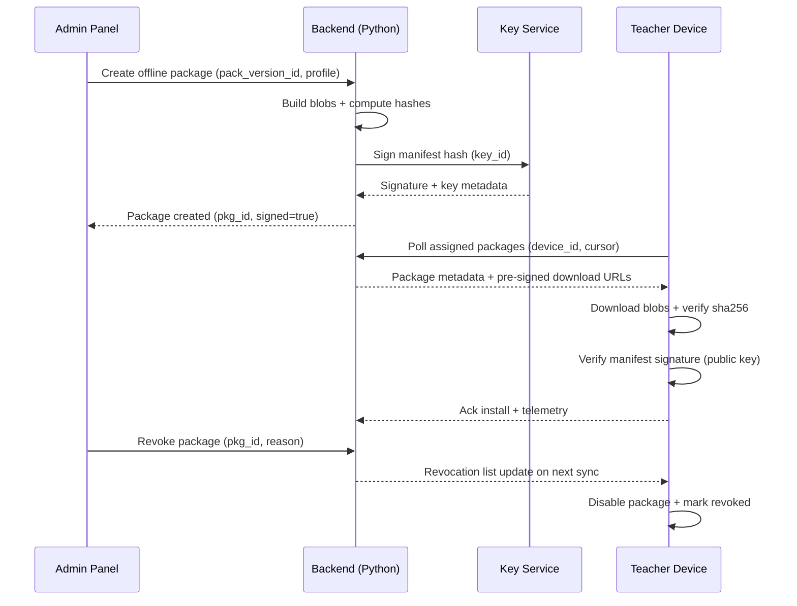
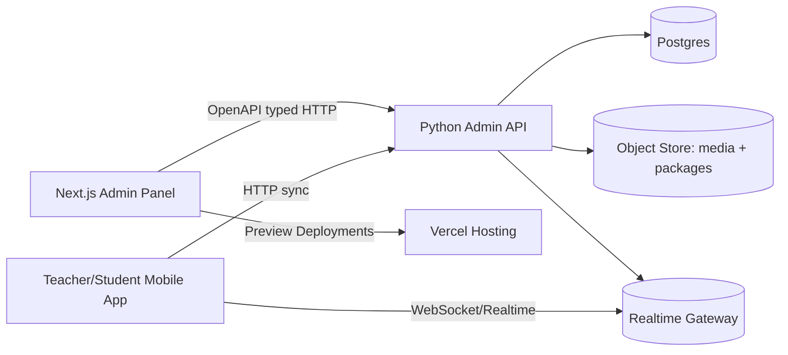
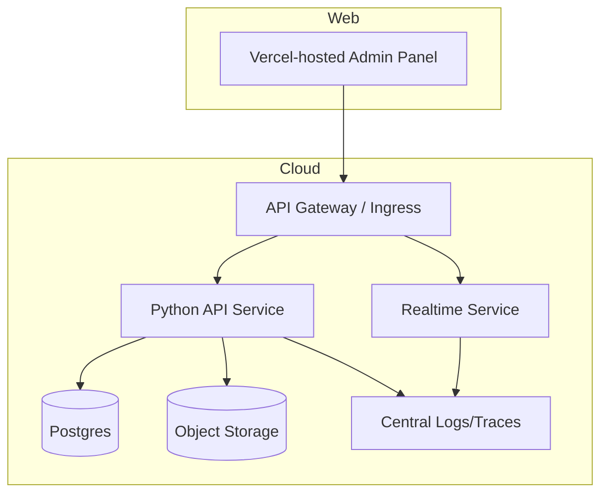

# Next.js Admin Panel Design for a Mobile-First Undergraduate Quiz Practice App

## Executive summary

We are designing an **Admin Panel** (web app in Next.js using the App Router) to support a mobile-first quiz practice product (React Native/Expo client) backed by Python services (FastAPI recommended). The Admin Panel is a **product surface**, not just an internal tool: it needs strong information architecture, high-throughput content authoring, safe publishing/versioning, and operational controls for classroom sessions and offline distribution.

Our guiding decisions are:

- **App Router + Route Handlers** in Next.js for a modern rendering model and to enable “BFF” (backend-for-frontend) proxy routes where needed; Route Handlers work inside the `app/` directory and create custom request handlers using web-standard Request/Response APIs. citeturn0search4turn0search10turn0search0  
- **Vercel preview environments** for rapid iteration of admin UX and safe change review: each deployment gets a unique URL, and preview environments are created by default on non-production branches/PRs. citeturn4search1turn4search13turn4search9  
- **OpenAPI-first contracts**: use an OpenAPI description for admin actions to standardize client integration and allow tooling; OpenAPI is specifically defined as a language-agnostic interface description for HTTP APIs. citeturn4search3turn4search15  
- **FastAPI for admin-facing APIs** due to tight OpenAPI integration and automatic docs (Swagger UI at `/docs` and ReDoc at `/redoc` by default in FastAPI docs references). citeturn0search7turn0search1turn0search9  
- **SSO/LTI readiness**: when we integrate with higher-ed ecosystems, LTI 1.3 explicitly uses a security model based on OpenID Connect, signed JWTs, and OAuth 2.0 workflows. citeturn1search2turn1search0turn1search8  
- **Auditability and security** as first-class product requirements, informed by OWASP mobile security standards and guidance to treat the network as untrusted. citeturn1search1turn1search15turn1search5  
- **FERPA/GDPR-aware architecture**: when used in postsecondary contexts, education records and personal data constraints drive role separation, least-privilege access, and retention policies. citeturn3search0turn3search1turn3search5  

Deliverable: a page inventory with wireframe-level notes, a backend contract approach, a data model sketch, offline package and local session operational UX, deployment workflow recommendations, security/compliance controls, implementation estimates per major area, and example code + API definitions.

## Admin panel UI and page inventory

### UX framework and navigation model

We will treat the Admin Panel as four primary “workspaces,” each with distinct mental models:

1. **Content Studio** (course packs, questions, media, publishing, offline packages)  
2. **Classroom Ops** (live sessions, rosters, devices, local/offline modes, reports)  
3. **Analytics & Reporting** (learning outcomes, item performance, cohorts, exports)  
4. **Governance** (users/roles, SSO/LTI config, billing, moderation, logs, audit trail, policies)

We will implement a **desktop-first admin layout** with responsive behavior for tablet and “mobile admin,” but we will not assume instructors/admins primarily use phones to author content. Mobile admin should still support session hosting, attendance, and quick edits.

### Page inventory table with layout notes and estimates

Effort estimates assume one experienced full-stack engineer (Next.js + TypeScript) plus one backend engineer for dependencies, and include UI + basic integration tests. “Person-weeks” are rough ranges for initial implementation and do not include content migration/QA at scale.

| Area | Page / component | Wireframe-level layout notes | Key UI components | Desktop vs mobile interactions | Complexity | Est. effort | Dependencies |
|---|---|---|---|---|---:|---:|---|
| Dashboard | Overview dashboard | Header: org/course selector. Left: “Needs attention” queue. Center: KPIs + recent activity. Right: alerts. | KPI cards, activity feed, filters, quick actions | Desktop: 3-column. Mobile: stacked cards + sticky course selector | Med | 2–4 pw | Backend analytics endpoints |
| Content Studio | Course & pack builder | Split view: left tree (topics/LOs), center editor, right preview + publish status | Tree nav, rich text editor, preview pane, publish button with state | Desktop: 3-pane. Mobile: tabs (Tree / Edit / Preview) | High | 6–10 pw | Pack versioning, permissions |
| Content Studio | Question bank | Table/grid with faceted filters (topic, type, difficulty, status, author) + bulk actions | Data table w/ virtualization, tag chips, bulk select, saved views | Desktop: table heavy. Mobile: card list + simplified filters | High | 5–9 pw | Search/indexing, pagination |
| Content Studio | Question editor | 3 sections: (1) stem & assets, (2) answer schema, (3) feedback & hints. Always-visible “validation panel.” | Markdown/MDX editor, choice builder, JSON schema panel, preview, linting | Desktop: side-by-side author/preview. Mobile: stepper wizard | High | 8–14 pw | Validation service, media upload |
| Content Studio | Media library | Grid of assets with metadata, usage count, “where used,” and license fields | Drag/drop upload, CDN preview, metadata editor, dedupe | Desktop: grid + details drawer. Mobile: minimal upload + view | Med | 3–6 pw | Object storage + signing |
| Content Studio | Publishing center | Timeline view: drafts → review → published. Diff viewer between pack versions. | Version list, diff viewer, approvals, rollback | Desktop: diff side-by-side. Mobile: diff read-only | High | 6–12 pw | Versioning, signing keys |
| Classroom Ops | Session host controls | Live “control room”: question queue, pacing buttons, results histogram, participant list | Start/pause/next controls, timer, live charts, QR/join code | Desktop: multi-panel. Mobile: “host mode” one panel at a time | High | 6–12 pw | Realtime gateway, session state |
| Classroom Ops | Roster management | Import roster, map to identities, section grouping, role assignment | CSV import, merge tool, inviter, group builder | Desktop: spreadsheet-like. Mobile: read-only + quick invite | Med | 4–8 pw | Identity service, LTI NRPS later |
| Classroom Ops | Offline package manager | Package list w/ status (draft/signed/revoked), download links, device distribution, telemetry | Package builder wizard, signing, revocation, device assignment | Desktop: wizard + audit pane. Mobile: view + download | High | 7–14 pw | Signing service, device sync |
| Classroom Ops | Device fleet & keys | Teacher device registry + key rotation + trust state | Device cards, key rotation workflow, revoke button, last-seen telemetry | Desktop: manage. Mobile: minimal | High | 5–10 pw | PKI/key service, telemetry |
| Analytics | Course analytics | Skill-map view + cohort drill-down + item analysis | Heatmaps, cohort filters, export buttons | Desktop: interactive. Mobile: summarized | High | 6–12 pw | Warehouse/aggregations |
| Analytics | Question analytics | Item stats: difficulty, discrimination proxy, hint usage, time | Charts, segmentation, version comparisons | Desktop: full. Mobile: read-only | Med–High | 4–8 pw | Event analytics |
| Governance | User management | Users table + roles + invitations + MFA enforcement | User table, role editor, invite modal, MFA status | Desktop: manage. Mobile: limited | Med | 4–8 pw | Auth service, RBAC |
| Governance | Roles & RBAC policies | Role builder with permission matrix + scope (org/course/section) | Permission matrix UI, policy preview, simulation | Desktop only (recommended) | High | 6–10 pw | RBAC engine |
| Governance | SSO/OIDC config | Configure identity provider(s), redirect URIs, JWKS, claims mapping | Form wizard, test login, logs | Desktop: wizard. Mobile: view | High | 5–9 pw | OIDC flows; OIDC = identity layer on OAuth2 citeturn1search0 |
| Governance | LTI 1.3 config | Tool registration details, keysets/JWKS, deployment IDs, scopes | Config forms, conformance checklist | Desktop: forms + validation | High | 6–12 pw | LTI security model uses OIDC + signed JWT + OAuth2 citeturn1search2 |
| Governance | Billing & entitlements | Plan definitions, seats, invoices, usage (AI/help quotas), refunds | Stripe-like tables, seat allocator, webhook log viewer | Desktop: full. Mobile: minimal | Med | 4–8 pw | Billing provider + webhooks |
| Governance | Content moderation | Reports queue (copyright, abuse, unsafe content), reviewer tools | Triage queue, redaction tools, decision logging | Desktop: primary. Mobile: triage | High | 6–12 pw | Moderation rules + storage |
| Observability | Logs & tracing | Searchable request logs, correlation ID drill-down | Log table, filters, export, trace viewer | Desktop: full. Mobile: view only | Med | 4–8 pw | Log pipeline |
| Observability | Audit trail | Append-only audit log viewer with diff and actor | Audit timeline, diff modal, actor metadata | Desktop: full. Mobile: view | Med | 3–6 pw | Audit log schema |
| Settings | System settings | Global settings: rate limits, feature flags, retention thresholds | Feature flag console, config editor, validation | Desktop: full. Mobile: view | Med | 3–6 pw | Config service |
| Policy | Policy controls | Admin-defined policies for help/AI, assessment mode restrictions | Policy editor, rules preview, enforcement status | Desktop: full. Mobile: view | High | 5–10 pw | Policy engine |

### Key page deep dives

#### Course & pack builder

**Goal:** enable instructors/curriculum managers to build a course pack with topic structure, learning objectives, and publishable versions.

**Layout (desktop wireframe concept)**
- Left: Topic tree with drag-and-drop reordering + LO count badges
- Center: Topic editor (description, LO list, quiz coverage targets)
- Right: Version panel (draft status, validation warnings, publish button, “who changed what”)

**Critical components**
- “Coverage meter”: shows unanswered LO coverage and “question density” (LOs with <N questions)
- “Publish gate”: blocks publishing when QA rules fail (missing explanations, invalid answer schema)

**Interaction**
- Desktop: 3-pane, persistent context.
- Mobile: Switch to a stepper: Topics → LOs → Coverage → Review → Publish.

#### Question editor

**Goal:** rapidly author high-quality quizzes with consistent answer schemas and feedback.

**Authoring model**
- Question type defines schema: MCQ/multi-select/short-answer/code-output/etc.
- Each question has: stem, answer rule, explanation, hint ladder, misconceptions, metadata, and references.

**Validation panel (always visible on desktop)**
- Blocks: “must fix” (schema errors) vs “should fix” (missing misconception tag) vs “informational”
- “Preview as student” renders the exact mobile UI.

**Why strict validation matters**
- Admin panel must produce content that renders safely on mobile and in offline packages; schemas reduce runtime ambiguity.

image_group{"layout":"carousel","aspect_ratio":"16:9","query":["admin dashboard UI wireframe example","question editor UI design split pane","course curriculum builder tree pane UI","audit log viewer UI"],"num_per_query":1}

## Tech stack and integration approach

### Why we use Next.js App Router for the Admin Panel

We use App Router because it is the newer router and supports modern React features including Server Components; Next.js docs explicitly distinguish App Router from Pages Router and note App Router supports Server Components. citeturn0search4turn0search6turn0search2

Operationally, App Router supports:

- **Route Handlers** in `app/` to build “BFF” endpoints (proxying to Python backend, adding admin-only headers, transforming payloads). Route Handlers are only available in `app/` and are equivalent to API routes from the Pages Router. citeturn0search10turn0search0turn0search14  
- **Middleware** for request-time routing controls (e.g., blocking unauthenticated users, redirecting based on tenant, setting headers). Next.js docs describe middleware running before a request is completed and allowing rewrite/redirect/headers changes. citeturn0search12  
- **Flexible deployment**: Next.js can be deployed as a Node.js server, Docker container, or static export (limited for server features). citeturn0search16turn0search18  

### UI library options and recommendation

We will pick one of two “UI strategies” based on team preference and desired customization:

**Option A: Headless + utility CSS (recommended for long-term consistency)**  
- Radix UI for accessible primitives (positioned as an open source component library optimized for accessibility). citeturn1search3  
- Tailwind CSS for utility-first styling; Tailwind documents the “utility-first” approach and styling by combining utility classes. citeturn2search3turn2search9  
- Headless UI for unstyled accessible behavior components (explicitly described as completely unstyled, fully accessible). citeturn2search1turn2search4  

**Option B: Batteries-included component library (faster initial delivery)**  
- MUI as a comprehensive React component library implementing Material Design. citeturn2search2turn2search11  
- Chakra UI as accessible React components; Chakra positions itself as accessible and compatible with Next.js RSC. citeturn1search7  

**Our recommendation:** Option A (Radix + Tailwind) when the Admin Panel must closely match a custom design system and support dense admin-specific UI patterns (permission matrices, diff viewers). Option B (MUI/Chakra) when speed-to-first-version outweighs custom theming costs. The sources above establish the core design intent (accessibility and utility-first or component completeness). citeturn1search3turn2search3turn2search2turn1search7  

### State management

We keep global state small and prefer request-scoped state:

- Server Components and server-side data fetching where appropriate (reduce client bundle).
- Client-side query caching for high-interaction pages (question bank, logs).  
This is a design recommendation rather than a standards claim.

### Auth and RBAC patterns

**Auth foundation**
- For enterprise/institutional admin accounts we target OIDC: OpenID Connect is defined as an identity layer on top of OAuth 2.0 enabling clients to verify end-user identity and obtain profile information. citeturn1search0  
- For service-to-service and backend tokens we use JWTs: JWT is a compact, URL-safe means of representing claims; claims can be digitally signed and/or encrypted. citeturn1search8  

**RBAC**
We use hierarchical scopes:
- Org-level roles: “Org Owner”, “Org Admin”, “Billing Admin”
- Course-level roles: “Course Admin”, “Content Reviewer”
- Classroom roles: “Instructor”, “TA”
- System operators: “Support Engineer” (time-bounded access; audited)

We implement RBAC checks in two places:
1. Python backend enforcement (source of truth)  
2. Admin UI gating (UX only, never security)

### Backend integration options for Python

We support three viable backend configurations:

- **FastAPI (recommended)**: positioned as a modern, high-performance framework based on type hints; it produces OpenAPI schemas and provides interactive API docs (Swagger UI and ReDoc). citeturn0search3turn0search7turn0search1turn0search9  
- **Django REST Framework**: described as a powerful and flexible toolkit for building Web APIs. citeturn4search0  
- **Flask + extensions**: lightweight; viable but requires assembling OpenAPI, auth, and admin tooling. (This is a recommendation—no stable single primary source is cited here.)

We do **OpenAPI-first** for admin endpoints: OpenAPI is explicitly defined as a standard interface description for HTTP APIs. citeturn4search3turn4search15  

### API contract examples for key admin actions

Below, we show OpenAPI-style endpoint shapes (illustrative). We prefer to generate OpenAPI from Python and use codegen/types in Next.js.

**Admin: create/edit course pack**
- `POST /admin/v1/course-packs`
- `PATCH /admin/v1/course-packs/{pack_id}`
- `POST /admin/v1/course-packs/{pack_id}/publish`

**Admin: publish offline package**
- `POST /admin/v1/offline-packages`
- `POST /admin/v1/offline-packages/{pkg_id}/sign`
- `POST /admin/v1/offline-packages/{pkg_id}/revoke`

**Admin: start/stop local session**
- `POST /admin/v1/class-sessions`
- `POST /admin/v1/class-sessions/{session_id}/start`
- `POST /admin/v1/class-sessions/{session_id}/stop`

**Admin: revoke device key**
- `POST /admin/v1/devices/{device_id}/keys/{key_id}/revoke`
- `POST /admin/v1/devices/{device_id}/keys/rotate`

**Admin: export reports**
- `POST /admin/v1/reports/exports`
- `GET /admin/v1/reports/exports/{export_id}`

FastAPI’s OpenAPI and docs behavior supports this contract-driven approach; the OpenAPI schema is generated and exposed (e.g., `/openapi.json`) and FastAPI includes interactive docs. citeturn0search9turn0search11turn0search1  

## Data model and database considerations

### Entity design principles

We make admin entities “operationally safe” by default:

- **Versioning:** Course packs and questions are immutable once published; edits create new versions.
- **Signing:** Offline packages produce a signed manifest and content hash; revocation lists propagate to devices.
- **Auditability:** Every admin write action creates an audit record with actor, scope, before/after, reason.

### DB table map

We recommend relational storage (e.g., Postgres) for admin operations plus an object store for media and package blobs. Indexes support high-frequency reads for question search and session dashboards.

| Table | Purpose | Key fields | Indexing and notes |
|---|---|---|---|
| orgs | tenancy | id, name, created_at | unique(name) optional |
| users | identities | id, org_id, email, status, created_at | idx(org_id,email) |
| roles | role definitions | id, org_id, name | idx(org_id,name) |
| role_bindings | RBAC bindings | id, user_id, role_id, scope_type, scope_id | idx(user_id), idx(scope_type,scope_id) |
| courses | course container | id, org_id, code, term | idx(org_id,code,term) |
| rosters | roster metadata | id, course_id, source(lti/csv/manual) | idx(course_id) |
| roster_memberships | membership | roster_id, user_id, role | idx(roster_id), idx(user_id) |
| course_packs | pack registry | id, course_id, current_version_id | idx(course_id) |
| course_pack_versions | immutable pack snapshot | id, pack_id, version, state(draft/published), created_by, hash | idx(pack_id,version), idx(hash) |
| topics | topic tree per version | id, pack_version_id, parent_id, name | idx(pack_version_id,parent_id) |
| questions | question registry | id, org_id, canonical_code | idx(org_id,canonical_code) |
| question_versions | immutable question snapshot | id, question_id, version, type, stem, answer_rule, hash | idx(question_id,version), fulltext(stem) |
| media_assets | images/audio files | id, org_id, uri, sha256, license | idx(org_id,sha256) |
| offline_packages | package records | id, pack_version_id, build_status, manifest_hash, revoked_at | idx(pack_version_id), idx(manifest_hash) |
| offline_package_blobs | pointers to object store | package_id, blob_uri, size, sha256 | idx(package_id) |
| signing_keys | key mgmt | id, org_id, key_type(root/online), status, created_at | idx(org_id,status) |
| devices | teacher device registry | id, org_id, owner_user_id, platform, trust_state | idx(org_id,trust_state) |
| device_keys | per-device keys | id, device_id, public_key, status, rotated_at | idx(device_id,status) |
| class_sessions | session metadata | id, course_id, mode(cloud/lan), state | idx(course_id,state) |
| session_events | append-only events | id, session_id, seq, type, payload, created_at | idx(session_id,seq) |
| audit_log | admin audit trail | id, org_id, actor_user_id, action, scope, before, after, created_at | idx(org_id,created_at), idx(actor_user_id) |
| system_logs_ref | correlation mapping | id, correlation_id, trace_id | idx(correlation_id) |

### Retention policies

Retention policies should align with GDPR principles of storage limitation; the European Commission explicitly lists “storage limitation” among GDPR processing principles and advises that data should be stored for the shortest time possible with time limits to erase or review. citeturn3search1turn3search5  

For postsecondary deployments, the scope of “education records” can include grades, class lists, schedules, and more; our admin panel must treat detailed performance data as sensitive and minimize exposure. citeturn3search10  

## Offline package and local session operations

This section focuses on how the Admin Panel enables operations for “offline-first” classrooms (teacher device sync, package signing, revocation) without requiring sandboxing or AI.

### Admin UX for creating and signing offline packages

**Workflow (Admin Panel)**
1. Select a course pack version (published only).
2. Choose package profile:
   - “Practice offline” (includes explanations, hints)
   - “Assessment offline” (explanations hidden, stricter integrity, limited hint UI)
3. Build package: resolve media assets, compile manifest, compute hashes.
4. Sign package: use org signing key to sign manifest hash.
5. Assign distribution: choose teacher devices or instructors.
6. Monitor telemetry: “downloaded”, “installed”, “revocation applied”.

**Signing key management**
- Keys are controlled via Governance pages:
  - active key rotation schedule
  - “emergency revoke” button
  - separate signing keys per environment (staging vs prod)

This is security architecture; in LTI ecosystems, signed JWTs and OAuth2-based security appear in recommended modern security models (LTI 1.3 moved to OIDC, signed JWTs, OAuth2 workflows). citeturn1search2turn1search0turn1search8  

### Secure manifest format (recommended)

We treat the manifest as the authoritative “what is in this package” structure:

- `manifest.json` (canonical, content-addressed)
- Hashes for each content file and media asset
- Signature block referencing key ID
- Revocation list pointer (for later killswitch)

(We are describing a recommended format; we will ensure its correctness through internal cryptographic review.)

### Teacher device sync sequence (mermaid)



### Admin controls for local sessions

The Admin Panel supports **policy-driven, constrained session types**, including local network sessions. Even when offline, we assume “don’t trust the network”; OWASP’s mobile security cheat sheet explicitly states to assume network communication is insecure and can be intercepted. citeturn1search15  

Therefore, Admin Panel policy controls must include:

- Whether local sessions are allowed for a course (default off)
- Required join method (QR only vs code allowed)
- Whether anonymous participants allowed
- Whether results export allowed immediately or only after sync

## Development workflow and deployment

### Monorepo layout recommendation

We recommend a single monorepo to keep version compatibility and shared types:

- `apps/admin` (Next.js Admin Panel)
- `apps/mobile` (React Native/Expo app)
- `services/api` (Python API gateway / admin APIs)
- `services/realtime` (optional; websockets)
- `packages/shared` (schemas, OpenAPI-generated types, UI tokens)
- `infra/` (Terraform/Pulumi/Kustomize)

### CI/CD and preview environments

For Next.js, entity["company","Vercel","cloud hosting provider"] supports deployments where each deployment generates a unique URL for previewing changes; preview environments are created for pushes to non-production branches or PRs by default. citeturn4search1turn4search13  

We will use:
- PR-based preview deployments for `apps/admin`
- Automated API contract tests: “admin UI types match OpenAPI schema”
- Seeded staging data for course packs and permissions testing

### Hosting options

Admin Panel:
- Vercel managed hosting (best DX for Next.js) or a self-hosted Node/Docker deployment (for strict data residency). Next.js documentation lists these deployment options and notes Node and Docker support all features. citeturn0search16turn0search18  

Backend:
- Containers on entity["company","Amazon Web Services","cloud platform"] / entity["company","Google Cloud","cloud platform"] / entity["company","Microsoft Azure","cloud platform"] (recommendation; choice depends on data residency and institutional procurement).

### Secrets management

- Environment-scoped secrets (staging/prod separation)
- Key material stored in KMS/HSM where possible
- Strict emergency rotation SOP for signing keys and OIDC client secrets

## Security, compliance, and operational controls

### Admin auth hardening

We harden admin auth along three layers:

1. Identity provider: OIDC (identity layer on OAuth2). citeturn1search0  
2. Token: JWT for short-lived access tokens; JWT can be signed and/or encrypted. citeturn1search8  
3. Authorization: backend-enforced RBAC and scoped permissions

We also support:
- Mandatory multi-factor authentication for admin roles
- IP allow-listing for “system operator” roles where feasible
- Step-up auth for dangerous operations (key rotation, package revocation)

### Audit trails and logs

We implement:
- Append-only `audit_log` table for admin actions (who changed what, when, why)
- Correlation IDs included in admin requests and backend responses (traceability)
- Exportable audit reports for institutional compliance reviews

### SSO/LTI security controls

LTI 1.3 moved away from OAuth 1.0a signing toward a model using OIDC, signed JWTs, and OAuth2 workflows; we surface these requirements directly in the LTI config page and provide validation checks. citeturn1search2turn1search10  

### FERPA and GDPR considerations

For postsecondary usage:
- FERPA rights transfer to the student at 18 or upon entering postsecondary; our admin UX must respect least-privilege and limit disclosure of personally identifiable information from education records. citeturn3search0turn3search2  
- GDPR principles include lawfulness, purpose limitation, data minimization, and storage limitation; we implement retention and deletion controls in admin settings, along with “data protection by design and by default” practices. citeturn3search1turn3search19  

### Monitoring and incident response (operational bullets)

We keep this short and actionable:

- Detect: alert on unusual admin actions (mass exports, key rotation, abnormal revocations)
- Contain: emergency “disable local sessions” and “revoke signing key” toggles
- Eradicate: rotate secrets, invalidate tokens, revoke packages, patch exploited endpoints
- Recover: restore services, verify integrity, communicate to institutions/users
- Lessons learned: postmortem and policy updates

Risk framing is aligned with entity["organization","OWASP","application security org"] guidance: mobile security standards and the assumption that the network is untrusted. citeturn1search1turn1search15turn1search5  

## Implementation estimates and dependencies

### Major epics summary

| Epic | Includes | Complexity | Effort range | Key dependencies |
|---|---|---:|---:|---|
| Content Studio | pack builder, question bank, editor, publishing center | High | 25–45 pw | Versioning, search, media |
| Classroom Ops | sessions, rosters, device mgmt, offline packages | High | 25–50 pw | realtime, signing, device sync |
| Analytics | dashboards, exports, item analytics | High | 15–30 pw | event pipeline, aggregation |
| Governance | users/roles, SSO/LTI, billing, policies | High | 20–35 pw | OIDC, LTI, billing |
| Observability | logs, audit, trace drill-down | Med | 8–16 pw | centralized logging |

These are additive and parallelizable with 2–3 engineers per stream.

## Example snippets and API definitions

### Next.js page skeleton (App Router)

```tsx
// apps/admin/app/(org)/courses/[courseId]/packs/page.tsx
import { PacksTable } from "@/components/packs/PacksTable";

export default async function CoursePacksPage({
  params,
  searchParams,
}: {
  params: { courseId: string };
  searchParams: Record<string, string | string[] | undefined>;
}) {
  // Server-side fetch to Python backend (recommended)
  // NOTE: in production, use a typed client generated from OpenAPI.
  const res = await fetch(
    `${process.env.API_BASE_URL}/admin/v1/courses/${params.courseId}/course-packs`,
    { cache: "no-store", headers: { "x-admin-app": "next" } }
  );

  if (!res.ok) throw new Error("Failed to load course packs");

  const data = await res.json();
  return (
    <main className="p-6">
      <h1 className="text-xl font-semibold">Course Packs</h1>
      <PacksTable packs={data.items} />
    </main>
  );
}
```

Route Handler example if we choose a BFF proxy layer:

```ts
// apps/admin/app/api/admin/course-packs/route.ts
export async function POST(req: Request) {
  const body = await req.json();

  const upstream = await fetch(`${process.env.API_BASE_URL}/admin/v1/course-packs`, {
    method: "POST",
    headers: { "content-type": "application/json" },
    body: JSON.stringify(body),
  });

  return new Response(await upstream.text(), {
    status: upstream.status,
    headers: { "content-type": upstream.headers.get("content-type") ?? "application/json" },
  });
}
```

Route handlers are a first-class capability in App Router; they use standard Request/Response APIs and live in the `app` directory. citeturn0search10turn0search0  

### FastAPI admin endpoint example

```py
# services/api/admin_routes/course_packs.py
from fastapi import APIRouter, Depends, HTTPException
from pydantic import BaseModel
from uuid import UUID

router = APIRouter(prefix="/admin/v1", tags=["admin-course-packs"])

class CreatePackRequest(BaseModel):
    course_id: UUID
    title: str
    description: str | None = None

class PackResponse(BaseModel):
    id: UUID
    course_id: UUID
    title: str
    state: str  # draft/published
    current_version: int

@router.post("/course-packs", response_model=PackResponse)
def create_course_pack(req: CreatePackRequest, actor=Depends(...)):
    # RBAC check omitted for brevity
    # Persist pack and version=1 draft
    ...
```

FastAPI’s documentation emphasizes OpenAPI-based API creation and automatic docs; it generates an OpenAPI schema and provides interactive docs UIs. citeturn0search7turn0search9turn0search1  

### OpenAPI-style endpoint definition (illustrative)

```yaml
paths:
  /admin/v1/offline-packages/{pkg_id}/sign:
    post:
      summary: Sign offline package manifest
      parameters:
        - name: pkg_id
          in: path
          required: true
          schema: { type: string, format: uuid }
      requestBody:
        required: true
        content:
          application/json:
            schema:
              type: object
              properties:
                signing_key_id: { type: string, format: uuid }
                reason: { type: string }
              required: [signing_key_id]
      responses:
        "200":
          description: Signed package metadata
```

OpenAPI’s specification defines a standard, language-agnostic interface description for HTTP APIs. citeturn4search3turn4search15  

## Diagrams and deployment topology

### Admin → backend → mobile flow



### Deployment topology (recommended)



Vercel’s documentation describes deployments producing unique URLs for previewing changes and preview environments for PR/branch deployments, supporting this topology for the admin app. citeturn4search1turn4search13  

## Comparison and final recommendations

### Next.js admin alternatives

**Next.js (App Router)**  
- Strength: mature ecosystem, server-capable rendering, Route Handlers, flexible deployment options and strong managed hosting on Vercel; Next.js docs lay out multiple deployment targets. citeturn0search16turn0search18turn0search10  
- Tradeoff: App Router concepts (RSC boundaries) require discipline on what belongs in server vs client.

**Remix**  
- Strength: form-centric data mutations; excellent for CRUD-heavy admin tools.  
- Tradeoff: smaller ecosystem for certain admin dashboard patterns (recommendation based on typical ecosystem maturity; no single primary source cited here).

**Plain React (CRA or minimal Vite SPA)**  
- Strength: predictable client-only runtime.  
- Tradeoff: less ergonomic secure server-side integration; pushes auth/proxy to separate infrastructure (this is a recommendation).

**SvelteKit**  
- Strength: compact performance and nice DX.  
- Tradeoff: smaller org familiarity and shared-knowledge base for enterprise admin patterns (recommendation).

### Python backend options

- **FastAPI**: best fit when we want OpenAPI-first contracts and rapid admin endpoint delivery with automatic docs. citeturn0search7turn0search1turn0search9  
- **Django REST Framework**: strong toolkit for Web APIs and brings a mature Django security posture; Django documents robust CSRF protections and security topics. citeturn4search0turn4search2  
- **Flask**: viable for small scope but requires more assembly and consistency work (recommendation).

### Recommended stack

We will build:

- Admin Panel: Next.js App Router, Radix UI + Tailwind, typed API client generated from OpenAPI  
- Backend: FastAPI for admin endpoints + a separate realtime service (as needed)  
- Auth: OIDC + JWT-based access tokens; LTI 1.3 support in Governance tier (later milestone) citeturn1search0turn1search8turn1search2  
- Compliance posture: FERPA/GDPR-informed data minimization, retention controls, and auditability from day one citeturn3search0turn3search1turn3search5  

This setup yields a high-leverage admin system: fast content production, safe publishing/versioning, operational classroom tooling (including offline packaging), and a defensible compliance posture.