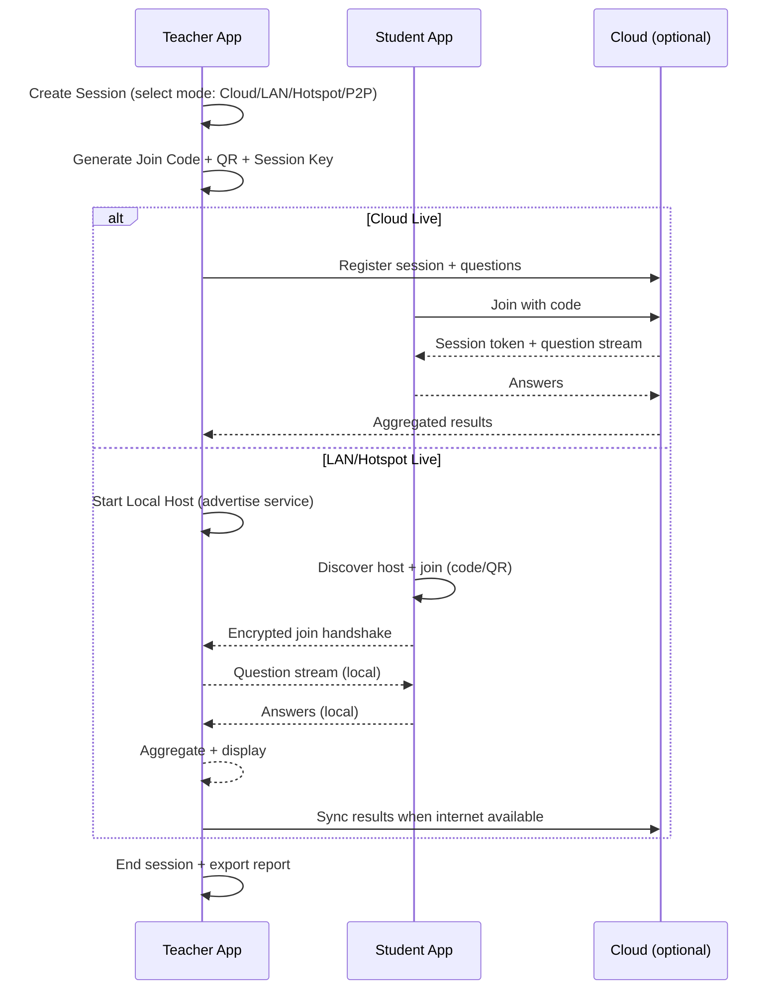
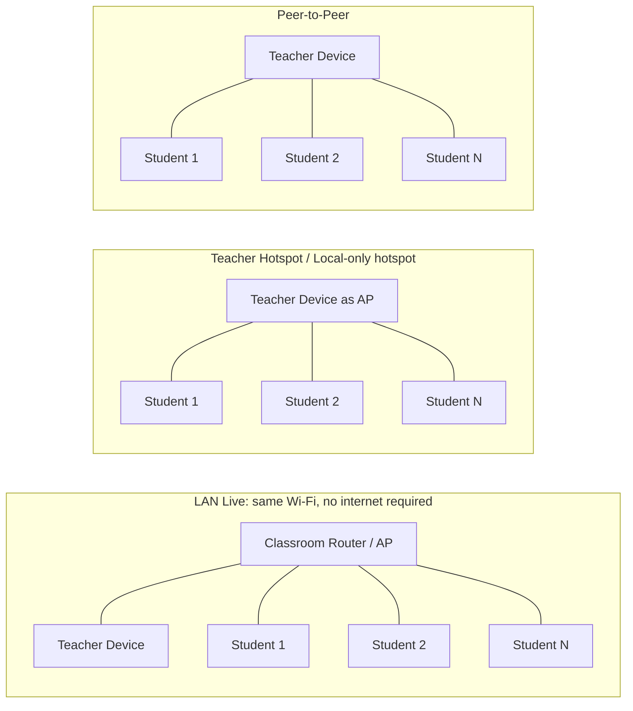

# Product Requirements Document for a Mobile-First Undergraduate Quiz Practice App

## Executive summary

This PRD defines a **mobile-first quiz practice application** for undergraduate students in Data Science, AI, Computer Science, and related fields, with a strong emphasis on **high-frequency retrieval practice**, **fast feedback**, and **in-context help** while preserving academic integrity. The product is designed to work in three realities that are common in undergraduate learning environments:

- Students practice in **short, mobile sessions** (5–15 minutes) and need a frictionless UX.
- Campus connectivity is inconsistent; the app must support **offline-first** study and, optionally, **in-class local delivery** modes.
- Institutions and instructors want high-signal outcomes: **insights, attendance/participation, and exam-aligned practice**, without the operational overhead of building question banks from scratch.

A major differentiator in this PRD is **Class Mode** with optional **local/offline delivery** configurations (hotspot / LAN / peer-to-peer), informed by how existing tools support offline teaching constraints. For example, **entity["organization","Plickers","paper card classroom polling"]** explicitly supports running sessions without student devices and states that sessions “can even be taken offline” when there’s no internet. citeturn0search9turn0search13 **entity["company","ZipGrade","paper mcq scanning app"]** states that scanning/grading works without internet and syncs later. citeturn1search3turn1search22 **entity["company","iClicker","classroom response system"]** supports physical remotes via a plug-and-play base station, a pattern that avoids student internet dependence in class. citeturn0search0turn0search34

This PRD specifies a tiered offering:

- **Basic (Free)**: best-in-class mobile quiz practice, limited offline packs, essential analytics.
- **Professional (Paid)**: deeper analytics, spaced review engine, offline libraries, class participation history.
- **Premium (Paid)**: in-context AI tutor (RAG), code/item autograding extensions, advanced study plans, richer accessibility tooling.
- **Admin/Instructor**: course packs, class sessions, teacher-led live quizzes, local-network delivery options, reporting, and governance.

Local connectivity and offline delivery introduce platform constraints: iOS requires explicit **local network privacy** support (Info.plist entries and a permission flow), and Android requires runtime “Nearby devices” permissions when manipulating Wi‑Fi peer/hotspot features. citeturn4search16turn4search1turn4search2turn3search8 Security requirements align with OWASP guidance on insecure communication and mobile risk categories. citeturn3search7turn3search19

## Product scope and design principles

### Target users and use cases

**Primary user (B2C):** Undergraduate learners in DS/AI/CS who want frequent practice aligned to coursework.

**Secondary user (B2B2C):** Instructors, teaching assistants, and departments who want reusable quiz banks, in-class engagement, and reporting.

Core learning use cases:

- “I have 10 minutes—give me a quick quiz on today’s lecture topic.”
- “I’m stuck—explain *why* my answer is wrong and what concept I’m missing.”
- “I have a midterm in two weeks—build a revision plan grounded in my weak areas.”
- “In class, I want to run a live check-for-understanding even if the Wi‑Fi is down.”

### Non-goals for this PRD (to keep scope controlled)

- Full MOOC delivery (multi-hour courses, video hosting, credentialing)
- Career-placement marketplace
- Full LMS replacement (though LMS integrations are planned for Admin/Instructor tier later)

### Mobile-first UX principles

- **One-handed operation** by default; primary actions within thumb-zone.
- **Micro-sessions**: 3–10 questions per session, resumable without penalties.
- **High clarity** per item: minimal cognitive overhead in UI, maximal signal in feedback.
- **Latency discipline**: taps must feel instant; offline fallback must be graceful.
- **Integrity-safe help**: “explain and guide” > “give answer,” especially in Class Mode.

## Quiz feature set by tier

### Tier mapping table

| Feature family | Basic (Free) | Professional | Premium | Admin/Instructor |
|---|---:|---:|---:|---:|
| Mobile quiz player (MCQ, multi-select, short answer) | ✅ | ✅ | ✅ | ✅ |
| Core feedback (correctness + explanation) | ✅ | ✅ | ✅ | ✅ |
| Offline practice packs | Limited | Expanded | Expanded + smart sync | Class packs + offline distribution |
| Spaced review engine | Limited queue | ✅ | ✅ (advanced plans) | ✅ (course-level settings) |
| Skill map + analytics | Basic | Advanced | Advanced + predictive | Cohort dashboards |
| In-context help (non-AI hint ladder) | ✅ | ✅ | ✅ | ✅ (authoring tools) |
| AI tutor (RAG citations, guardrails) | — | Optional add-on | ✅ | ✅ (policy + analytics) |
| Code/SQL question format + autograding | — | Limited (beta) | ✅ | ✅ (author & assign) |
| Class Mode live sessions (internet) | Join only | Join + history | Join + AI help policy | Host + proctor controls |
| Class Mode local/offline delivery | — | Limited join | ✅ (device support varies) | ✅ (full hosting) |
| Integrations (LTI/LMS, exports) | — | Export | Export + SSO options | LTI/LMS/SSO + roster sync |
| Compliance / governance tools | — | — | Partial | ✅ |

### Basic (Free) tier requirements

#### Feature B1: Mobile quiz player (core)

**Description**  
A fast mobile quiz player supporting: MCQ, multi-select, true/false, matching (lite), and short answer (strict or rubric). Minimum viable “quiz unit” is 3–10 questions with instant navigation and resumability.

**User stories**
- As a student, I can start a quiz in under 5 seconds and answer with one thumb.
- As a student, I can pause mid-quiz and resume later without losing progress.

**Acceptance criteria**
- Launch-to-first-question median < 2.5s on mid-range devices (cached content).
- Offline scenario: previously downloaded quizzes open and run fully without network.
- Accessibility: supports dynamic type and screen reader labeling for all interactive controls.

**UI/UX notes (mobile-first)**
- Answer choices as large tap targets (≥44pt).
- Single “Next” CTA; swipe left/right optional but never required.
- “Question clarity rail”: concept tag + difficulty + time estimate (small, non-distracting).

**Complexity / effort / deps**
- Complexity: Low–Medium  
- Effort: 3–5 person-weeks  
- Dependencies: Mobile app + local DB; minimal backend for content fetch

#### Feature B2: Immediate feedback and explanations

**Description**  
After each answer, show correctness plus a short explanation, and (if incorrect) a “common misconception” note when available.

**Acceptance criteria**
- Feedback renders within 300ms after submission (local rules).
- Explanation length capped with “expand” to avoid scrolling fatigue.

**Complexity / effort / deps**
- Complexity: Medium  
- Effort: 2–3 person-weeks  
- Dependencies: Content authoring pipeline for explanations and misconception tags

#### Feature B3: Hint ladder (non-AI)

**Description**  
A structured hint system: Hint 1 (concept nudge) → Hint 2 (worked micro-step) → Hint 3 (solution skeleton / elimination strategy). Prevents “answer reveals” in Basic.

**Acceptance criteria**
- Hints can be consumed without leaving the question.
- Hint usage logged (for analytics and personalization later).

**Complexity / effort / deps**
- Complexity: Medium  
- Effort: 2–4 person-weeks  
- Dependencies: Content schema + authoring tools (Admin tier can author)

#### Feature B4: Limited offline practice packs

**Description**  
Download a small number of quiz packs per week for offline study.

**Acceptance criteria**
- Downloaded packs include: questions, media, explanations, and scoring rules.
- Offline results are queued and sync when network returns.

**Complexity / effort / deps**
- Complexity: Medium  
- Effort: 4–6 person-weeks  
- Dependencies: Sync engine + conflict strategy

### Professional tier requirements (student subscription)

#### Feature P1: Spaced review queue (course-aligned)

**Description**  
A spaced review queue that schedules reattempts based on correctness, confidence, and time since last attempt. Focus is undergrad coursework topics (DSA, SQL, probability, linear algebra basics, ML fundamentals).

**Acceptance criteria**
- “Due today” queue updates daily; users can snooze without losing streak logic.
- Can set exam date; scheduler shifts intensity toward exam horizon.

**Complexity / effort / deps**
- Complexity: Medium  
- Effort: 4–7 person-weeks  
- Dependencies: Analytics events + scheduler service + local notifications

#### Feature P2: Advanced analytics (skill map)

**Description**  
Skill map by topic and subtopic, with metrics: accuracy, time-to-answer, hint rate, last practiced, and “confusion topics.”

**Acceptance criteria**
- Users see top 3 weak areas and recommended next action.
- Exportable personal report (PDF/CSV optional).

**Complexity / effort / deps**
- Complexity: Medium  
- Effort: 4–6 person-weeks  
- Dependencies: Event pipeline + aggregation jobs + dashboards

#### Feature P3: Expanded offline library + smart sync

**Description**  
Professional unlocks larger offline libraries and faster, incremental sync.

**Acceptance criteria**
- Sync is resilient: retries on background/foreground transitions and intermittent connectivity.
- Clear local storage management (“downloaded content uses X MB”).

**Complexity / effort / deps**
- Complexity: Medium–High  
- Effort: 5–8 person-weeks  
- Dependencies: Robust sync protocol, content versioning

#### Feature P4: Class Mode participation history (join-only)

**Description**  
Students can join instructor sessions (internet-based) and see their participation after class.

**Acceptance criteria**
- Join flow completes within 20 seconds using code or QR.
- Session results visible for student only unless opted-in.

**Complexity / effort / deps**
- Complexity: Medium  
- Effort: 3–5 person-weeks  
- Dependencies: Session service + real-time messaging (WebSocket)

### Premium tier requirements (advanced and AI-enabled)

#### Feature R1: AI tutor with retrieval grounding (RAG) and citations

**Description**  
In-context help that references vetted materials (course pack notes, official explanations) and produces guided hints. The system must be designed to operate “even without internet” only if local models/content exist; otherwise it gracefully degrades to non-AI hints.

Important technical framing: peer-to-peer connectivity options on Android can support offline device discovery and encrypted exchanges (e.g., Nearby Connections is designed to work regardless of network connectivity and provides encrypted communication). citeturn0search2turn0search5

**Acceptance criteria**
- AI responses include: (a) “why this is wrong,” (b) a next-step hint, (c) citations to the local knowledge base sources used.
- Safety: refuses direct answer for assessment-mode questions unless instructor policy allows.
- Latency: p95 < 4s for “hint” responses under normal connectivity.

**Complexity / effort / deps**
- Complexity: High  
- Effort: 8–14 person-weeks  
- Dependencies: LLM gateway + retrieval store + content chunking + policy engine

#### Feature R2: Code/SQL quiz items with autograding (quiz-focused, not full IDE)

**Description**  
Support code output prediction, fill-in-the-blank, and “fix the bug” items; optional code execution for Python/SQL. This remains quiz-centric: no complex project scaffolding.

**Acceptance criteria**
- Autograder supports deterministic unit tests and timeouts.
- For offline: code execution is disabled unless local sandbox is present; items fall back to static evaluation formats.

**Complexity / effort / deps**
- Complexity: High  
- Effort: 10–18 person-weeks  
- Dependencies: Sandboxing infrastructure + execution queue + security controls

#### Feature R3: Premium offline packs with “exam simulation mode”

**Description**  
Offline “exam simulation” sets: timeboxed, no hints, local-only storage until reconnected, integrity controls.

**Acceptance criteria**
- Exam mode sets a local lock state (no AI tutor, no solution reveal).
- Results sync includes integrity metadata (timestamps, pauses).

**Complexity / effort / deps**
- Complexity: Medium–High  
- Effort: 5–9 person-weeks  
- Dependencies: Offline engine + tamper-resistant logging strategy

### Admin/Instructor tier requirements (governance and classroom workflows)

#### Feature A1: Course pack builder and question authoring

**Description**  
Instructor tools to create a course pack: topics, learning objectives, question sets, explanations, misconception tags, and hint ladders.

**Acceptance criteria**
- Bulk import (CSV/JSON) + in-app editor.
- Versioning: publish new pack version without breaking in-progress attempts.

**Complexity / effort / deps**
- Complexity: High  
- Effort: 10–16 person-weeks  
- Dependencies: Admin portal + content pipeline + permissions model

#### Feature A2: Teacher-led Class Mode sessions (internet-based baseline)

**Description**  
Instructor can host live quizzes, pace questions, show aggregated results, and export participation.

**Acceptance criteria**
- Host can start, pause, resume, and end session.
- Students join by code/QR; a roster can be optional.
- Instructor sees real-time distribution per question.

**Complexity / effort / deps**
- Complexity: High  
- Effort: 10–14 person-weeks  
- Dependencies: Real-time backend, session state machine, anti-abuse controls

#### Feature A3: Local/offline delivery modes (advanced)

**Description**  
Enable hosting sessions when there is no internet or unreliable campus Wi‑Fi. This feature**must** ship with explicit feasibility constraints per platform and with strong security restrictions, because local networks are high-risk for MITM and impersonation if poorly authenticated. OWASP explicitly highlights insecure communication as a key testing area and mobile risk categories include insecure communication and weak cryptography. citeturn3search7turn3search19

**Acceptance criteria**
- Instructor can choose a “Delivery Mode” at session creation:
  - Cloud Live (internet)
  - LAN Live (same Wi‑Fi, no internet required)
  - Teacher Hotspot Live (teacher device or edge hub provides Wi‑Fi)
  - Peer-to-Peer (platform-dependent)
- Student devices receive and submit answers locally; results sync later if desired.

**Complexity / effort / deps**
- Complexity: High  
- Effort: 14–24 person-weeks (depends heavily on P2P scope)  
- Dependencies: Local discovery + encryption + device identity + offline session ledger

## Class Mode workflows and offline/local connectivity options

### Teacher–student session flow (mermaid)

### Network topology options (mermaid)

### Local connectivity approaches: feasibility, pros/cons, security implications

Below are the supported strategies for local delivery, prioritized by engineering feasibility and classroom reliability.

#### LAN Live (same Wi‑Fi network, internet optional)

**How it works**  
Teacher device runs a local session host; students connect over the same WLAN (even if the WLAN has no internet). This aligns with typical “local network” discovery patterns such as Bonjour/MDNS.

**Feasibility**
- iOS: feasible, but requires local network privacy support and explicit purpose strings; Apple documents local network privacy requirements and permission flows. citeturn4search16turn4search1turn3search10  
- Android: feasible; discovery can be via mDNS or manual code; permissions depend on Wi‑Fi scanning/discovery use. citeturn4search2

**Pros**
- Most stable across mixed-device classrooms.
- Does not require special P2P APIs; works with standard IP networking.

**Cons**
- Requires a functioning AP/router; campus AP isolation settings may block device-to-device traffic.

**Security implications**
- Must enforce TLS or an equivalent encrypted transport even on LAN (OWASP stresses network communication security and MITM resistance). citeturn3search7  
- Must prevent rogue “fake teacher host” devices: require code/QR + session key confirmation.

#### Teacher Hotspot Live (teacher phone hotspot or Android local-only hotspot)

**How it works**  
Teacher provides Wi‑Fi network for the session; students join it. On Android, a “local-only hotspot” can create a WLAN network explicitly for local communication without internet access. citeturn3search8

**Feasibility**
- Android: feasible and explicitly documented; apps may require runtime permission (e.g., “Nearby Wi‑Fi devices”) depending on target SDK and API usage. citeturn3search8turn4search2  
- iOS: possible via Personal Hotspot but programmatic control is limited; treat as “instructor-guided setup” rather than an API-driven guarantee.

**Pros**
- Works even when campus Wi‑Fi is unreliable.
- Predictable topology and bandwidth.

**Cons**
- Battery drain on teacher device; limits on maximum clients depending on device and OS.
- Classroom triage overhead: students switching networks.

**Security implications**
- Hotspot SSID/password must rotate per session to limit eavesdropping.
- Even though there is “no internet,” local attackers can still sniff/attack if encryption is absent.

#### Wi‑Fi Direct / Wi‑Fi P2P (Android-first peer-to-peer)

**How it works**  
Android Wi‑Fi Direct allows devices to connect directly without an intermediate access point. Android’s Wi‑Fi P2P documentation describes discovery and connection methods for peer-to-peer communication. citeturn1search0turn1search4

**Feasibility**
- Android: feasible, but device support varies; requires permissions and robust handling of discovery/connect lifecycle.
- iOS: not a direct equivalent as a public “Wi‑Fi Direct API”; cross-platform parity is difficult.

**Pros**
- No router required.
- Good throughput and distance relative to Bluetooth.

**Cons**
- Operational complexity: group owner negotiation, reconnections, vendor quirks.
- Mixed iOS/Android classrooms complicate rollout.

**Security implications**
- Must layer strong app-level authentication on top of link security.
- Must resist “evil twin” group owner impersonation (session key verification is mandatory).

#### Peer-to-peer frameworks: iOS Multipeer & Android Nearby Connections

**iOS Multipeer Connectivity**  
Apple documents that Multipeer Connectivity uses infrastructure Wi‑Fi networks, peer‑to‑peer Wi‑Fi, and Bluetooth PAN transport. citeturn0search1 Practical constraints exist: Apple engineering discussion indicates Bluetooth-only multipeer is not a reliable modern assumption; plan around Wi‑Fi (infrastructure or peer-to-peer Wi‑Fi). citeturn0search11

**Android Nearby Connections**  
Google documents it as a P2P API for discovery, connection, and data exchange “regardless of network connectivity,” using Bluetooth/BLE/Wi‑Fi and encrypted transfers. citeturn0search2turn0search5

**Feasibility**
- iOS-only peer mesh: feasible with Multipeer; requires local network privacy compliance depending on discovery methods. citeturn4search16turn4search1  
- Android-only peer mesh: feasible with Nearby Connections; requires Google Play services and correct permissions. citeturn0search2turn4search15  
- Cross-platform: difficult without a cross-platform P2P layer; LAN Live is usually the pragmatic cross-platform baseline.

**Pros**
- No router required.
- Designed for proximity-based discovery.

**Cons**
- Platform fragmentation (Android-only or iOS-only).
- Harder QA matrix (OS versions, vendor radios, permissions).

**Security implications**
- Must implement explicit classroom trust establishment: “teacher device fingerprint” confirmation and rotating session keys.
- Must account for “nearby device permission” friction and user trust prompts on both platforms. citeturn4search16turn4search2

### Class Mode join flows

**Join primitives (ranked)**
1. **QR code** (fastest, lowest error rate in-class)
2. **Short join code** + optional room name
3. **NFC tap** (optional; hardware/OS permissions)
4. **Deep link** (only in internet-connected contexts)

**Student join acceptance criteria**
- If local mode: app must detect that the student is not on the correct network and show a one-tap “Help me join the class network” checklist.
- Join must always show the teacher identity confirmation step: “You are joining *CS101 – Section A – Prof X*.”

### Existing apps that support teacher-driven local/offline quiz delivery

This is a niche capability; most classroom quiz platforms are designed to be “online live.” For example, **entity["company","Socrative","online student response system"]** is framed as a cloud-based real-time assessment tool and emphasizes online use; offline/local delivery is not its primary mode. citeturn2search2turn2search8 Similarly, **entity["company","Wayground","quizizz rebrand 2025"]** markets “online quizzes live,” suggesting internet-first live modes. citeturn2search25turn2search10

However, there are notable offline-adjacent patterns:

- **entity["organization","Plickers","paper card classroom polling"]**: Students use printed cards; no student devices/accounts; official help states sessions can be taken offline when no internet is available. This is a “teacher device + camera scanning” offline operational model. citeturn0search9turn0search33  
- **entity["company","iClicker","classroom response system"]**: Physical remotes can be used with a plug-and-play base station; the base is required for physical remote participation, indicating in-room collection independent of student internet. citeturn0search0turn0search34turn0search6  
- **entity["company","TurningPoint","turning technologies clickers"]**: University documentation describes a USB receiver plugged into the instructor computer to register student handset responses, a local in-room collection model. (Internet requirements for sync/reporting vary by deployment and are not consistently specified.) citeturn2search19  
- **entity["company","ZipGrade","paper mcq scanning app"]**: Mobile optical scanning for paper MCQ assessments; official site and support state internet is not required for scanning/grading and sync can occur later, which is an offline-first grading workflow. citeturn1search3turn1search22  
- **entity["organization","Moodle","learning management system"]** mobile app: Moodle documentation describes offline quiz attempts under specific quiz settings (notably restrictions like no time limit; deferred feedback behaviors), plus synchronization and conflict resolution behaviors. This is offline attempt + later sync, not local peer delivery, but it demonstrates “offline assessment constraints” needed to preserve integrity. citeturn1search2turn1search6turn1search17  
- **entity["company","Kahoot!","game-based learning platform"]**: Official support specifies downloading kahoots for offline use in the mobile app for solo modes (flashcards/learn/test/solo classic), but states that live games/multiplayer require internet. This is offline practice (B2C) rather than offline teacher-led live delivery. citeturn2search0turn2search9turn2search3  

## Data model sketch and API surface

### Data model sketch (high-level)

| Table | Key fields (illustrative) | Notes |
|---|---|---|
| users | id, email/phone, created_at, role(student/instructor/admin), locale, consent_flags | Support anonymous student mode for local sessions |
| devices | id, user_id, platform(iOS/Android/Web), push_token, device_public_key, last_seen_at | Needed for local auth + push |
| courses | id, org_id, title, term, metadata | Admin-managed; optional for B2C-only |
| course_packs | id, course_id, version, published_at, offline_eligible, signing_key_id | Versioning is critical for offline consistency |
| topics | id, course_pack_id, parent_topic_id, name, outcomes | Skill map backbone |
| questions | id, topic_id, type, stem, options_json, correct_rule, explanation, hints_json, tags, difficulty | Supports multiple item formats |
| quizzes | id, owner_id, mode(practice/exam/class), settings_json | Quiz = configuration + references |
| quiz_items | quiz_id, question_id, order, points, time_limit_s(optional) | Item ordering and scoring |
| attempts | id, user_id, quiz_id, started_at, ended_at, mode, device_id, integrity_flags | Attempt-level “ledger” |
| attempt_answers | attempt_id, question_id, answer_json, is_correct, response_time_ms, hint_steps_used | Supports per-question sync |
| class_sessions | id, course_id, host_user_id, delivery_mode, join_code, started_at, ended_at | Live session state |
| session_participants | session_id, participant_id(user or anonymous), join_time, leave_time, role | Supports anonymous join in local |
| offline_packages | id, pack_type(course_pack/quiz), content_hash, signed_manifest, created_at | Distribution artifacts |

### Example API endpoints (cloud)

**Auth / identity**
- `POST /v1/auth/login`
- `POST /v1/auth/refresh`
- `POST /v1/users/me/device-keys` (register device public key)

**Content**
- `GET /v1/course-packs?eligible_for_offline=true`
- `GET /v1/course-packs/{id}/manifest`
- `GET /v1/questions/{id}`

**Quiz lifecycle**
- `POST /v1/quizzes` (create practice quiz)
- `POST /v1/attempts` (start attempt)
- `POST /v1/attempts/{id}/answers` (append answer; idempotency key)
- `POST /v1/attempts/{id}/finalize`

**Class Mode**
- `POST /v1/class-sessions` (host starts)
- `POST /v1/class-sessions/{id}/join` (student joins)
- `POST /v1/class-sessions/{id}/events` (real-time stream token)
- `POST /v1/class-sessions/{id}/end`
- `GET /v1/class-sessions/{id}/report`

**Sync**
- `POST /v1/sync/batch` (upload queued offline events)
- `GET /v1/sync/changes?since_cursor=...`

### Local session API (edge / teacher-hosted)

For LAN/Hotspot Live, define a local HTTP(S) interface with the same resource semantics but smaller surface:

- `GET /local/session` (metadata + host fingerprint)
- `POST /local/join` (mutual auth handshake)
- `GET /local/question/{n}`
- `POST /local/answer` (append-only events)
- `GET /local/results` (aggregated distribution)

**Important platform note:** local network discovery and access on iOS requires local network privacy support and Info.plist declarations; Apple explicitly covers this permission flow in WWDC guidance and technical notes. citeturn4search16turn4search1turn4search3

## Offline-first behavior, edge cases, and security requirements

### Offline/edge modes

#### Offline practice mode (student)

- Download pack → run quizzes offline → store answers locally → sync later.
- Conflict handling: enforce append-only event log; server resolves using timestamps and question-level versions, similar to the question-by-question synchronization approach described in Moodle mobile offline quiz documentation. citeturn1search2

**Edge cases**
- Content version mismatch: if a question changes, the app must preserve the original version used in the attempt (store question hash in attempt ledger).
- Clock drift: do not trust device time for integrity; store monotonic counters.

#### Offline class session mode (teacher-led local)

- Teacher starts local session host (LAN/Hotspot/P2P).
- Students join locally; answers are transmitted locally; teacher view aggregates locally.
- Sync later: teacher device uploads session ledger to cloud when available.

**Edge constraints inspired by real offline assessment limitations**
- Time limits may be restricted or handled locally with special integrity marking; Moodle offline quiz attempts have explicit restrictions (e.g., time limits and behaviors) for offline attempt eligibility, underscoring that offline assessment has configuration constraints. citeturn1search6turn1search17

### Permissions and platform compliance (local connectivity)

- Android: if targeting Android 13+, apps that manage Wi‑Fi connections should request `NEARBY_WIFI_DEVICES`; Android documentation also shows which Wi‑Fi APIs require it and how to assert “neverForLocation.” citeturn4search2turn4search26  
- Android local-only hotspot: Android docs specify local-only hotspot networks have no internet access and enable device-to-device communication; permission requirements apply. citeturn3search8turn4search2  
- iOS: local network privacy requires explicit support and a permission prompt for local networking protocols (e.g., Bonjour). citeturn4search16turn4search1turn4search6

### Security implications (requirements)

Security requirements are mandatory because classroom modes and offline modes increase exposure to:

- Local MITM/sniffing on shared Wi‑Fi
- Rogue host impersonation
- Replay attacks (resubmitting answers)
- Data exfiltration from lost devices

OWASP guidance explicitly highlights network communication vulnerabilities (MITM, packet sniffing) and mobile risk lists include insecure communication, insecure authentication, and insufficient cryptography. citeturn3search7turn3search19

**Required controls**
- **Mutual authentication** for local sessions:
  - Teacher device has a long-term device keypair.
  - Session uses ephemeral keys and rotating session secrets.
- **Transport security**:
  - Use TLS for LAN modes where feasible; if not, use message-level encryption (AEAD).
- **Join hardening**:
  - QR includes: join code + host fingerprint hash + optional roster scope.
  - Student UI must confirm teacher identity (“matches QR fingerprint”).
- **Tamper-evident event log**:
  - Append-only ledger with hash chaining for answers in Class Mode.
- **Data minimization**:
  - In anonymous local sessions, avoid collecting student identifiers unless required.
- **Secure local storage**:
  - Encrypt sensitive data at rest on device (keys protected by OS keystore).

## Delivery estimates, dependencies, and technical risk

### Recommended delivery milestones

**Milestone 1: Quiz MVP (mobile-first, Basic + partial Pro)**  
- B1–B4 + P1 (basic spaced queue) + P2 (basic analytics)
- Target: 8–12 weeks with 3–5 engineers

**Milestone 2: Class Mode (internet) + Instructor authoring (baseline)**  
- A1 + A2 + P4
- Target: 10–14 weeks

**Milestone 3: Local/offline Class Mode (LAN + teacher hotspot first)**  
- A3 (LAN Live + Hotspot Live)
- Target: 12–20 weeks (high QA + device matrix)

**Milestone 4: Premium AI tutor and advanced quiz types**  
- R1 + selected R2 formats
- Target: 10–18 weeks (depends on content readiness and evaluation rigor)

### Highest technical risks (and mitigations)

1. **Cross-platform local distribution**: P2P APIs differ; LAN Live is the safest baseline.  
2. **Permission friction**: iOS local network prompts and Android Nearby permissions can break onboarding; design guided setup and fallback to join code/manual IP. citeturn4search16turn4search2  
3. **Security in local modes**: must treat classroom Wi‑Fi as hostile; implement cryptographic session establishment and identity confirmation. citeturn3search7turn3search19  
4. **Offline assessment integrity**: constrain “offline exam modes” and mark attempts with integrity flags; follow the principle that offline eligibility may require restrictions (as Moodle documents for offline quiz attempts). citeturn1search6turn1search17  

### Dependencies summary by major capability

- **Backend (required for MVP)**: content delivery, attempt storage, analytics aggregation, auth.
- **Real-time layer (required for Class Mode internet)**: WebSockets / pub-sub.
- **Offline sync (required early)**: event batching, idempotency keys, conflict resolution.
- **LLMs (Premium)**: retrieval store + policy engine; must degrade gracefully when offline.
- **Sandboxing (Premium code items)**: execution isolation, resource limits, abuse controls.

